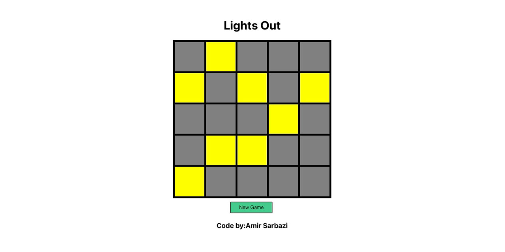

<div>
  <h1 align="center">A Todo List App with React 🧑‍💻</h1>
  <p><strong>The lights out game is a 5x5 matrix of lights. 
A random number of lights are on.
Pressing any of the lights will toggle it and the toggle neighbors.</strong></p>
<h2 style="">Goal:</h2>
  <ul>
  <li>
  Practicing function / props/ state / array
  </li>
    
   </ul>

  <p>
    Screenshot:
  </p>

  <a href="">
    
  </a>
</div>

<hr />

## Requirements
- NPM
- React

## Main Functions

`initialValue`

Before starting game we need some lights be turn On.
Initiate 5x5 matrix with a random value between 0 or 1

```javascript
    initialValue = () => {
        let initCell = [[0, 0, 0, 0, 0], [0, 0, 0, 0, 0], [0, 0, 0, 0, 0], [0, 0, 0, 0, 0], [0, 0, 0, 0, 0]]
        for (let i = 0; i < 5; i++)
            for (let j = 0; j < 5; j++)
                initCell[i][j] = Math.floor(Math.random() * 2)

        return initCell
    }
```
`Neighbours(x, y)`

  This function makes current cell to zero and
  Reverses the status of Neighbours from 0=>1 or 1=>0

  ```javascript
   Neighbours(x, y) {
        let tempCell = this.state.cells
        tempCell[x][y] = 0
        if (this.checkWin() === 0)
            this.setState({ isWin: true })
        else {
            if (x > 0)
                tempCell[x - 1][y] = 1 - tempCell[x - 1][y]
            if (x < 4)
                tempCell[x + 1][y] = 1 - tempCell[x + 1][y]
            if (y > 0)
                tempCell[x][y - 1] = 1 - tempCell[x][y - 1]
            if (y < 4)
                tempCell[x][y + 1] = 1 - tempCell[x][y + 1]
            this.setState({ cells: tempCell })
        }
    }
  ```
`checkWin()`

  If total of all cells is 0, you win!

```javascript
 checkWin() {
        let temp = this.state.cells
        let total = 0
        for (let i = 0; i < 5; i++)
            for (let j = 0; j < 5; j++)
                total = temp[i][j] + total
        return total

    }
 ```

`resetGame()`

  This is a simple function, we just need to initiate again.
```javascript
resetGame() {
        this.setState({ cells: this.initialValue(), isWin: false })

    }
```


# Getting Started with Create React App

This project was bootstrapped with [Create React App](https://github.com/facebook/create-react-app).

## Available Scripts

In the project directory, you can run:

### `npm start`

Runs the app in the development mode.\
Open [http://localhost:3000](http://localhost:3000) to view it in your browser.

The page will reload when you make changes.\
You may also see any lint errors in the console.

### `npm test`

Launches the test runner in the interactive watch mode.\
See the section about [running tests](https://facebook.github.io/create-react-app/docs/running-tests) for more information.

### `npm run build`

Builds the app for production to the `build` folder.\
It correctly bundles React in production mode and optimizes the build for the best performance.

The build is minified and the filenames include the hashes.\
Your app is ready to be deployed!

See the section about [deployment](https://facebook.github.io/create-react-app/docs/deployment) for more information.

### `npm run eject`

**Note: this is a one-way operation. Once you `eject`, you can't go back!**

If you aren't satisfied with the build tool and configuration choices, you can `eject` at any time. This command will remove the single build dependency from your project.

Instead, it will copy all the configuration files and the transitive dependencies (webpack, Babel, ESLint, etc) right into your project so you have full control over them. All of the commands except `eject` will still work, but they will point to the copied scripts so you can tweak them. At this point you're on your own.

You don't have to ever use `eject`. The curated feature set is suitable for small and middle deployments, and you shouldn't feel obligated to use this feature. However we understand that this tool wouldn't be useful if you couldn't customize it when you are ready for it.

## Learn More

You can learn more in the [Create React App documentation](https://facebook.github.io/create-react-app/docs/getting-started).

To learn React, check out the [React documentation](https://reactjs.org/).

### Code Splitting

This section has moved here: [https://facebook.github.io/create-react-app/docs/code-splitting](https://facebook.github.io/create-react-app/docs/code-splitting)

### Analyzing the Bundle Size

This section has moved here: [https://facebook.github.io/create-react-app/docs/analyzing-the-bundle-size](https://facebook.github.io/create-react-app/docs/analyzing-the-bundle-size)

### Making a Progressive Web App

This section has moved here: [https://facebook.github.io/create-react-app/docs/making-a-progressive-web-app](https://facebook.github.io/create-react-app/docs/making-a-progressive-web-app)

### Advanced Configuration

This section has moved here: [https://facebook.github.io/create-react-app/docs/advanced-configuration](https://facebook.github.io/create-react-app/docs/advanced-configuration)

### Deployment

This section has moved here: [https://facebook.github.io/create-react-app/docs/deployment](https://facebook.github.io/create-react-app/docs/deployment)

### `npm run build` fails to minify

This section has moved here: [https://facebook.github.io/create-react-app/docs/troubleshooting#npm-run-build-fails-to-minify](https://facebook.github.io/create-react-app/docs/troubleshooting#npm-run-build-fails-to-minify)
